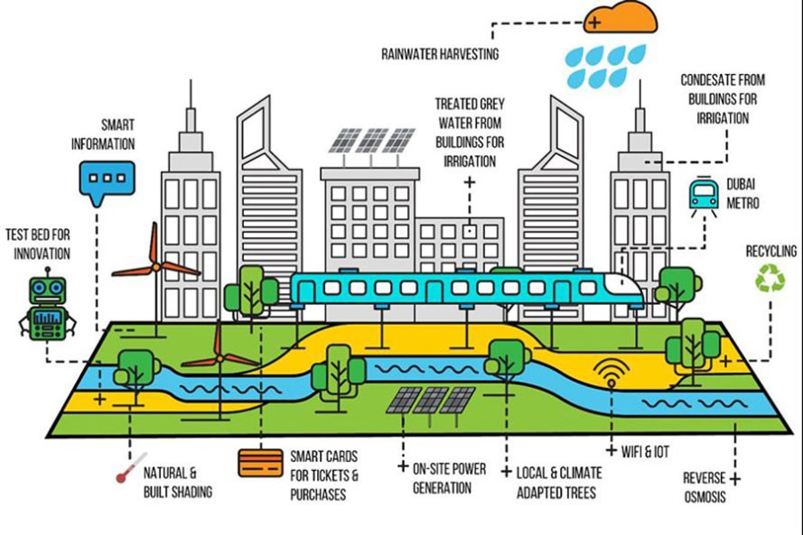
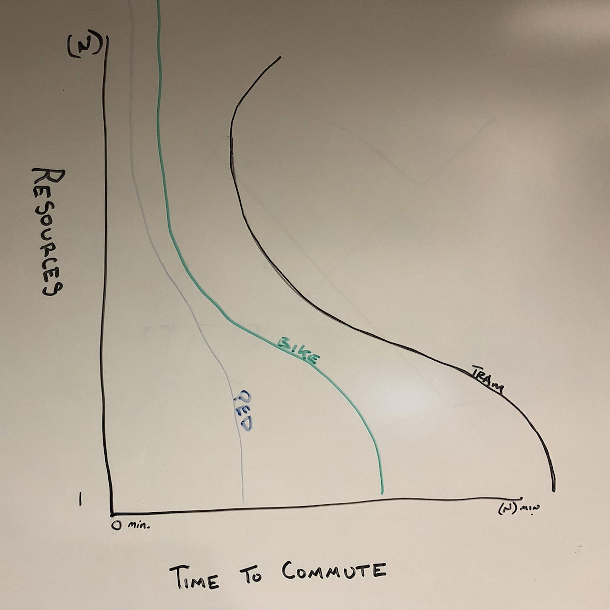

# IDS6145 - Research Plan  

> * Group Name: Divide & conquer 

> * Group participants names: Chiang, Hsian-Chin; Coad, Jonathan; Lord, John 

> * Project Title: How to Ace Green Space 

  

In our proposal, we wish to model a representation of an urban, city block that is turned to green space. We look to answer whether commuters can transition through said city block in an efficient and timely manner while utilizing shared resources. We believe that transitioning cities into car free “green zones” could enhance timeliness and help reduce emissions. This idea is already in progress across the pond and we want to examine how this revolutionary idea could work in America as well. 

  

 

## Introduction  

Project Goal: We wish to observe what the best, or average travel time may be for commuters to get through public, eco-city property while utilizing shared resources.  

Cities outside of the United States have already implemented these “car-free” zones and the results speak for themselves. Paris, France has already reduced overall emissions by thirty percent. This was done by reducing the number of cars on the streets and converting those spaces to green space. Hamburg, Germany has plans to create a green network by reducing automobiles and crowded traffic systems and replacing them with parks. Hamburg and Oslo saw over 40 percent reduction of NO2 gas emission (Nieuwenhuijsen & Khreis, 2016). Beijing, China is testing ways to decrease smog and environmental pollution by installing large filtration systems (Phillips, 2016). And Chengdu, China is promising their reduced traffic in urban areas will decrease traffic stalls, and they enable pedestrians to complete their commute in only fifteen minutes.  

In fact, there appear to be almost no negative aspects of car-free urban areas. The question then is, for cities in the United States of America that were built around the extensive use of vehicular traffic; can modern resources be used efficiently to effectively transition urban city space into green space.  

A smart city, or “eco-city” promotes the health and prosperity of its’ citizenry. The creation of green space within an eco-city is allowed by eliminating vehicular traffic in urban areas. This idea of transforming areas into green space has several potential benefits.  

*  Reduced carbon emissions mean that the air will be less polluted and cleaner for pedestrians  

*  The removal of independent vehicles on the roadway increases the safety levels of the street 

*  An overall boost to public health both mentally and physically and increased social awareness        
   (Kuo & Sullivan, 2001; White, 2013) 

++Our problem++ is that we need to show that transitioning to car-free superblocks can be just as, if not more efficient than the traditional method of commuting. This can become complicated due to the development of cities within America, and how the population is used to traditional routine when it comes to commuting.  

++Our Motivation++ for this is thoroughly discussed about with mental and physical benefits to our well-being. In addition to this, we also expect to see various benefits of commerce and public relations, similar to what has been seen in Spain and other areas (Vox, 2016). 

++Our proposed solution++ is to implement the idea of eco-friendly, urban, green zones into more cities within the United States. First, we will create a model of an urban city block. General hypotheses regarding the demographics and size of the block will help us to populate the number of businesses, residencies, entertainment options, and people (commuters, residents, shoppers). We will also create hypothetical resources that can be utilized by the various people within said block. These resources include: trams and tram path, bikes and bike path, and pedestrian paths. We will use AnyLogic to conduct a continuous-based simulation of this model and calculate the average time it takes for commuters to travel from parking hubs outside of the block, through the block to their generalized business locations, while utilizing shared resources (tram, bike, pedestrian paths) for residents, commuters and miscellaneous people. 

 

++Our contributions++ for this proposal include the following towards this and future projects: 

1. By promoting green zones within urban areas in the US, we are contributing to the mental health and eco-friendly environment. 

2. By conducting a continuous-based simulation with the said variables, we are promoting the idea that given the right amount of shared resources, placed in the right position, there will be little, to no degradation in outside participation/workability inside the green space.  

 

## The Model 

For this proposal we have chosen only to include a structural diagram. This is because we are not an agent-based model and therefore should not include a behavioral diagram. 

.png)

 

##Requirements:  

Overcrowding, pollution, and lack of recreation are all problems that a major city must face. To help alleviate these issues, green space(s) have been implemented, and somewhat successfully. This paper proposes the following experiment to see how well cities can transition from their current situation into eco-friendlier green zones. Requirements are as follows: 

1.  Given an urban area of size (n), wherein all the streets are closed to public traffic 

2.  Given public transportation is available (scalable) in the same area 

    a.  Public tram with variable routes through the area
      i. Tram includes three cars (can vary) 
     ii. Tram carries up to twenty-five passengers per car 
    iii. Tram travels fifteen mph 
   
    b.     Public bike rentals available at various locations through the area 
      i. Bikes can only carry ONE passenger 
     ii. Bikes travel at a constant of five mph 
    iii. Bikes can only travel one path. 

    c.     Public bike/pedestrian paths delineated through the area 
      i. Pedestrians can only travel on pedestrian area 
     ii. Pedestrians travel at two and a half mph 
3.  Commuter debarkation points are set; no more than four 

4.  Public interaction random AND set – population (p) size feasible for area (n) of consideration
    a.  Random population living within urban area traversing from point A (home) to point B (work)
    b.  Random population commute to debarkation point (parking garage) and traversing from point A (parking garage) to point B (work)
    c.  Random population utilizing green space with no start or end destination
    d.  All population randomly utilizing one of three modes of transportation 
      i. Walking paths 
     ii. Bike lanes (rental bikes)
    iii. Public tram
    
5. Population movement times set
    a.  Small percentage (10%) of population movement constantly between 6:00 a.m. and 11:00 p.m. – represents miscellaneous population
    b.  Random percentage (15-30%) of population movement between 9:00 a.m. and 11:00 p.m. – represents population utilizing businesses and green space
    c.  Working population (55%) movement between 6:00 a.m. and 9:00 a.m. (morning), 11:30 a.m. and 1:00 p.m. (lunch), and 3:30 p.m. and 6:30 p.m. (evening) 

6.  All buildings within area (n) identified
    a.  Office buildings
    b.  Residedntial buildings
    c.  Restaurant/entertainment building 

7.  Must compute and report average time for commuters to traverse from point A to point B 

 

## Fundamental Questions 

The following are some fundamental questions that we have established and would like to consider as we collect and analyze our data. 

1.  How can we reduce the average time for commuters to transition through green space, given fixed hub locations and shared resources.
    
    i.  Would increasing the available resources increase or decrease the average time  

2.  What are the correct placement of shared resources (paths routes, bike stand sizes and tram car sizes) in order to maximize commuter timelines while still being a benefit to other populations with the zone. 

    i. Are the existing ideas enough? Or, do we need to establish new ideas about commuting and implement them? 

   ii.  Are the current number of resources sufficient? Or, do we need to increase the available number of resources? 

3. What is the best possible location of commuter hubs in order to maximize commuter timeline? 

    i.  Would adding additional hubs make commuting more efficient? 

   ii.  Would moving the location of the commuter hubs make commuting more efficient? 

 

## Expected Results 

We hypothesize the following: 

1. Overall the average time of commute given an individual recourse (ped, bike, tram) is positively affected by the number of resources available, until a point of diminishing returns, when the amount of resources available either does not affect commute time, or negatively affects commute times. 

2. Combining all three resource types will positively affect the overall average commute time and have a lower point of diminishing returns wherein the amount of resources negatively effects the average commute time. 

3. There is an optimal location for available resources to be most utilized and contribute to the average commute time.  

4. There are optimal locations for pedestrian (ped), bike, and tram routes, and times when those resources will be most used and contribute the most to the average commute time. 

 

 

## Research Methods 

We believe that our goal can best be accomplished by using a continuous-based simulation. Specifically, we will use AnyLogic to model the city space and use human-like entities as our agents. Our city space will be representative of an urban city block that has been turned into green space. The continuous-based simulation was chosen because all agent choices are randomized (therefore not agent-based), and nothing within the simulation changes over time (therefore not discrete-event based). The model will need to be simulate multiple times to produce the average wait time for commuters as they travel from point A to point B.  

 

## References 

Balch, O. (2015, April 20). Garden cities: can green space bring health and happiness? Retrieved from The Guardian: https://www.theguardian.com/sustainable-business/2015/apr/20/garden-cities-can-green-spaces-bring-health-and-happiness 

Garfield, L. (2017, February 2). Business Insider. Retrieved from 12 major cities that are starting to go car-free: http://www.businessinsider.com/cities-going-car-free-2017-2 

Kuo, F. E. (2001). Aggression and Violence in the Inner City: Effects of Environment via Mental Fatigue. Environment and Behavior, 543-571. 

Nieuwenhuijsen, M.J., & Khreis, H. (2016). Car Free Cities: Pathway to Healthy Urban Living. Environment International, 94, 251-262.  

Phillips, B. (2016, July 20). A 23-Foot-Tall Air Purifier Gets a Tryout in Smoggy Beijing. Retrieved from https://www.nytimes.com/2016/07/21/us/a-23-foot-tall-air-purifier-gets-a-tryout-in-smoggy-beijing.html?_r=0  

Vox. (2016, September 27). Superblocks: How Barcelona is taking city streets back from cars. Retrieved from YouTube: https://www.youtube.com/watch?v=ZORzsubQA_M 

White, M. P. (2013). Would You Be Happier Living in a Greener Urban Area? A Fixed-Effects Analysis of Panel Data. Psychological Science, 920-928. 

