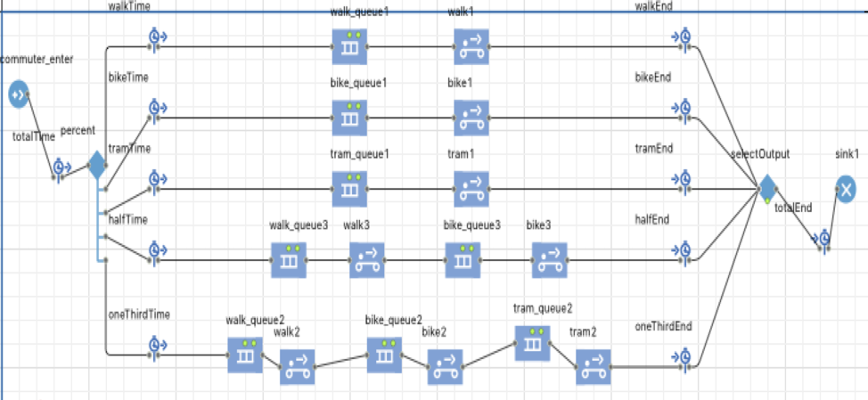
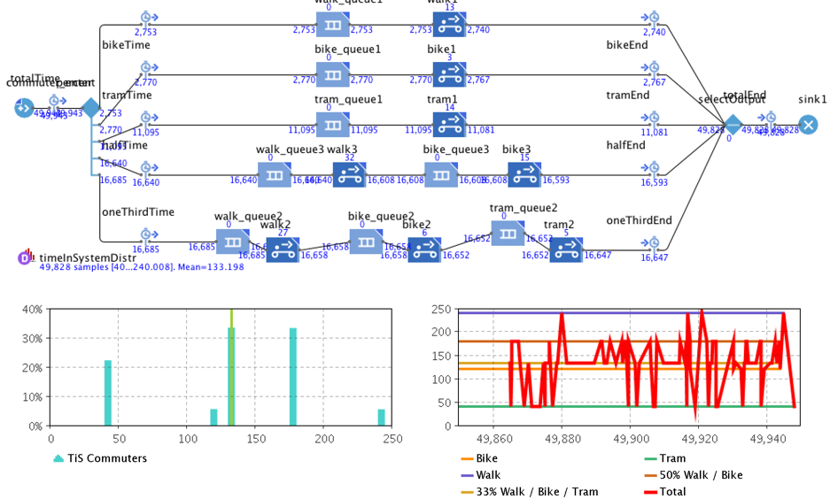
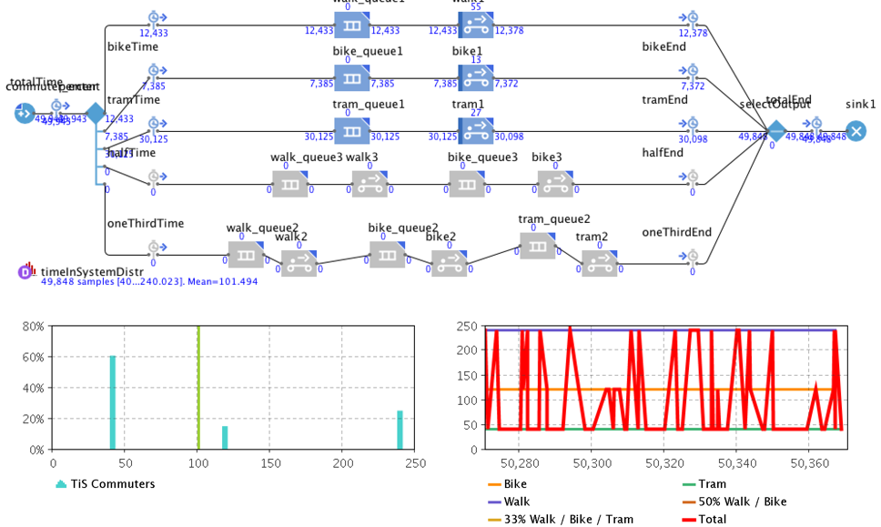
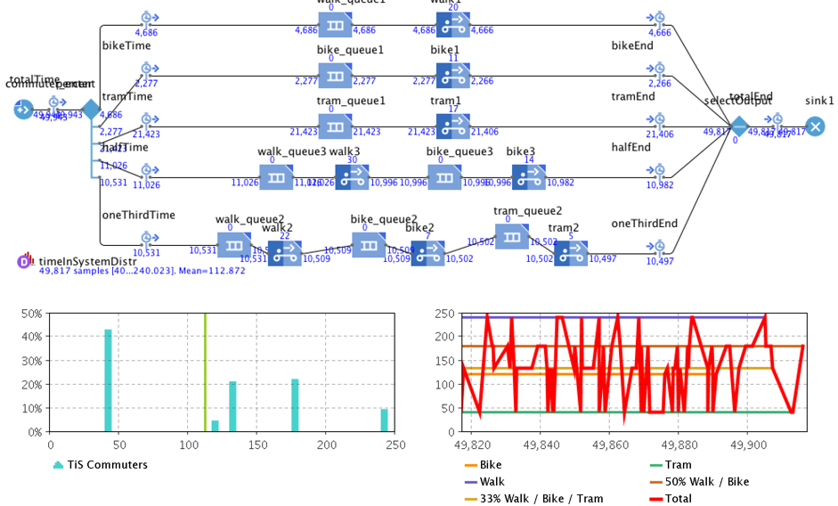
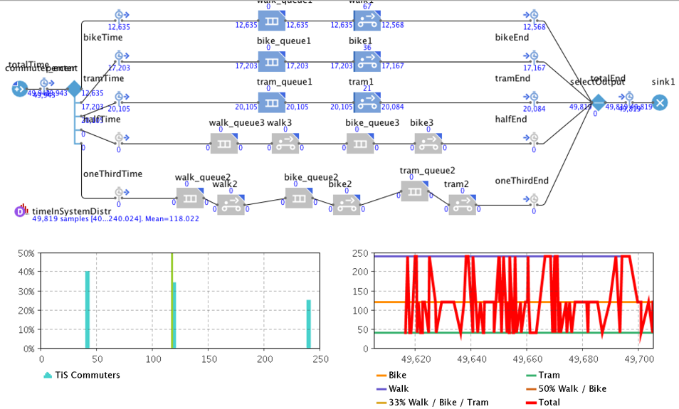
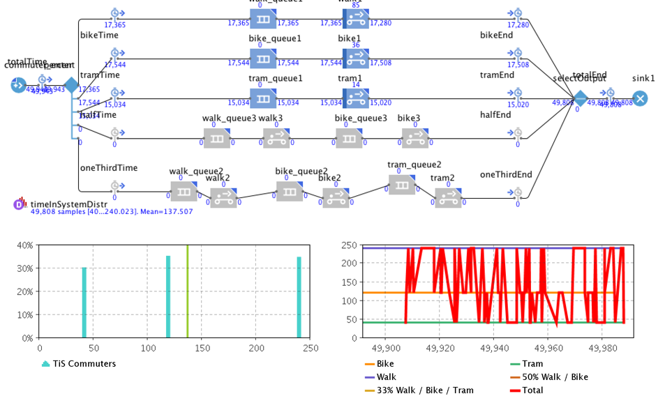
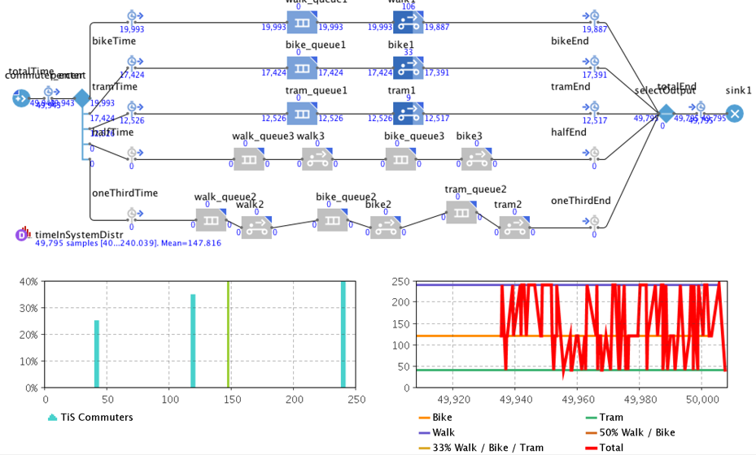

**How to Ace Green Space: A quantitative analysis of potential modes of transportation and commute times for pedestrians while utilizing shared resources in an urban environment**

**Jonathan Coad and John Lord**
University of Central Florida

In partial fulfillment of the requirements for Simulation Techniques with Dr. Joe Kider

May 1st, 2018

[TOC]

##Introduction

Green Space is a hot topic in many international cities. It is essentially an area that focuses on plants and vegetation within an urban environment. Traditionally, the use of automobiles is prohibited in such areas, unless they are shared resources such as a subway or tram. The use of green space in urban environments has not yet caught on in America. This paper is designed to observe the average travel time may be for commuters to get through public, eco-city property while utilizing shared resources in an American city. 

A smart city, or “eco-city” is one that uses green spaces throughout their city and encourages people to ditch the car and try a different means of transportation. These spaces generally promote the health and prosperity of the city’s citizenry. This idea of transforming areas into green space has several potential benefits. 

* Reduced carbon emissions mean that the air will be less polluted and cleaner for pedestrians 

* The removal of independent vehicles on the roadway increases the safety levels of the street 

* An overall boost to public health both mentally and physically and increased social awareness    
  (Kuo & Sullivan, 2001; White, 2013) 

Previous research has examined a traditional "park and ride" method of transportation. However, we look to model more of a "park and walk" idea. We believe that given the opportunity, people might prefer to commute on foot given that commuting times are equivalent. It is an idea that some schools have implemented and could work well in urban environments. Very little, if any research exists on this topic for American cities. We, therefore are investigating a new and exciting areas of research. 

Some of the research found indicate that bikes are a preferred method of transportation when given the choice and the appropriate resources. The United States Census Bureau reports that American workers have chosen to ride their bike when commuting to work at a significant rate. Over the course of a 10-year span, the number of cyclist commuters went up over 50%. Commuters who choose to walk are boasting high numbers as well, but automobiles still dominate as the primary mode of transportation likely because of their ease and speed. We look to change that.

We hope to show that transitioning within car-free superblocks can be just as, if not more efficient than the traditional method of commuting. This can become complicated due to the development of cities within America, and how the population is used to traditional modes of transportation such as cars when it comes to commuting. Additionally, it is important for commuters to know that walking is a viable option, even when resources are shared.

In order to achieve this goal, we propose to implement the idea of eco-friendly, urban, green zones into more cities within the United States. In turn, we can promote eco-friendly transportation when traversing through an urban area and positive well-being with well designed green space for commuters.

##Methods

#Design
We begin the first phase of our goal by creating a model of an urban city street. First, we will model a single street and analyze the average time for commuters to walk from one end to the other. Additional resources will be added to future iterations of our model in the sense of bicycles and a tram, along with additional agents that utilize the same resources. We will then discover the difference in time that it takes for commuters to travel down the street while utilizing resources that are now shared.
#Procedure
We will be creating our model in AnyLogic, a simulation tool that supports agent-based, discrete event and system dynamics simulation methodologies. Our model will employ agents in a discrete-event queueing system and will track average time of commutes. Values of speed will be given to each mode of transportation. Agents will be given pre-determined behaviors to simulate pedestrian traffic and will pick a method of transportation based on probability. To fully flesh out our proposal, we have decided to look at several outputs of information based on the number of agents that use each mode of transportation. Outputs to the system are as follows:

1) Commuters choose to walk only 
2) Commuters choose to bike only
3) Commuters choose to ride the tram only
4) Commuters split decision equally between bike and tram
5) Commuters split decision equally between walking, biking, and taking the tram

With our analysis, we we hope to contribute the following towards this and future projects: 

1. By promoting green zones within urban areas in the US, we are contributing to the mental health and eco-friendly environment. 

2. By conducting a discrete-event simulation with the said variables, we are promoting the idea that green spaces are viable for transportation within rural communities.

Additional parameters will be added in the sense of other agents that are using the shared resources. We will analyze how this affects the commute time for average users and decide on the best type of transportation in green spaces based on our results.
#Model
[Model Code](final/code/Project1.alp)

**Chart 1: Model representation**

This Anylogic model is created using the agent pallett. agents enter into the model at a rate of one per minute at the “commuter_enter” site. Agents are then split five ways as previously discussed: 1) Walk, 2) Bike, 3) Tram, 4) Bike and Tram, and 5) Walk, Bike, and Tram. The modeled distance from enter to exit is 10 km. 10km is used in order to ensure each system in the model has a significant distance to travel. This distance was used in consideration that traditional city blocks on average are less than one kilometer, and at most commuters would only travel a few city blocks during their commute. Each split line has a queue and a conveyor to represent a transportation system. The queue is set to allow 1000 agents with no wait time so that it does not detract from the transportation system. Each conveyor is modeled to represent a mode of transportation: walk, bike and tram. The walk conveyor is set to travel at a rate of 2.5 kph, the bike conveyer is set to travel at a rate of 5 kph, and the tram conveyor is set to travel at a rate of 15 kph. The only thing changed during the execution of this model is the percentage of agents (commuters) that are allowed within each line. Other timeline options are added for data visualization.

We will modify the percentage of agents that utilize the five outputs. By changing the percentages we will be able to show the shared utilization of resources between commuters and miscellaneous (misc) users such as shoppers and residents. For example: If misc agents in the model were to utilize 50% of the tram than the commuter would only be able to utilize the remaining 50%. The remaining 50% of commuters would then have to be split between the remaining walk and bike outputs. We are tracking the total time in system with a histogram. We are also tracking the total time using each output with a timeplot. The timeplot is being used to track the total time in system as an overlay. The mode (average) time is evident on the model at the statistical collection point. We will run the model over time; 50,000 minutes (modeled timeline). We are not looking for a specific amount of commuters but just getting the average time the commuters take over 50,000 minutes given the percentage of resource use within the model.
##Fundamental Questions
As we developed our experiment, some fundamental questions about how our process could work began to arise. We decided to prioritize on the amount of time that pedestrians would have to expend during their commute, and how we might be able to minimize that time. In addition, adding in people with other motivation to use the resources available might complicate things. We look to answer the following questions.
What is the average time for commuters to travel from point A to point B?
Given an average commute time, how does it vary when additional entities are competing to use the same resources?
How can we reduce the average commute time for pedestrians utilizing shared resources in an urban green space?

##Results

We will start with null findings for each output. Null percentages are based on assumptions made regarding the use of different transportation modes used by commuters. (if that was all they had available). More research is needed in this area. Observational -- research is not available yet because, to our knowledge, this is the first time this type of experiment is being conducted.  We have two null values: null-1 and null-2. Null-1 is defined as all commuters 20% walk, 30% bike and 50% take the tram.

The graph below shows that at the null-1 values the average commute time is 103.79 minutes. 

**Chart 2: Null-1 for single mode transportation**

The null-2 values for mixed modes of transportation. Null-2 is defined as 05% walk only, 05% bike only, 20% tram only 33% both walk and bike and 33% walk, bike and tram.

At the null-2 values for mixed modes of transportation the average commute time was 133.19 minutes. 

**Chart 3: Null-2 for mixed mode transportation**

As we add misc population into the model (shoppers, residents and others) we make some assumptions based in part on the limits of our research. Experiment one: Misc others prefer walk and bike. Commuters are forced to limited bike, increase walk and tram. In the following graph, 25% walk, 15% bike, and 60% of the population take the tram for single mode transportation. 

This graph indicates 101.49 minutes. This is a reduction of 2 minutes from null-1.

**Chart 4: Single mode misc population prefers to walk**

For mixed modes of transportation with misc population preferring to walk and bike. 10% walk, 05% bike, 45% tram only. 23% walk and bike. 22% walk, bike and tram.

Average commute time is 112.87 min. This is a reduction of commute time by 21 minutes from null-2.

**Chart 5: Mixed mode misc population prefers to walk**

Experiment two: If misc population prefered to take the tram that will limit the available resource for commuters. We will look at three different inputs: light - 10%, medium - 20% and heavy - 40%.

A light (10% on tram) reduction: commuters at 25% walk, 35% bike and 40% tram

Average commute time 118.02 min.

**Chart 6: Misc population use of tram, light**

A medium reduction (20% on tram): 35% walk, 35% bike, 30% tram. 

Average time is 137.5 min.

**Chart 7: Misc population use of tram, medium**

Heavy reduction (40% on tram): 40 % walk, 35% bike, 25% tram. 

Average time is 147.81

**Chart 8: Misc population use of tram, heavy**

##Discussion

Our results suggest that commuting to work, home, or entertainment in green space while using shared resources can have a dramatic difference for pedestrians depending on what method of transportation they choose. The tram seemed to have the biggest impact on commuters. The average commute time when the misc population changed shifted from 118 minutes to 147 minutes This is a 29 minute difference comparing a 40% and a 25% use of the tram mode of transportation. This is likely due to two factors, speed and availability. It should be obvious that the tram moves more quickly than the other options, so when available, it can offer a reduced travel time for commuters. The issue though is that when it becomes full, users who will not travel any other way must wait for it to deliver its passengers and then return to pick them up. This add significant amounts of commute time to their trip. In addition, as more people choose to use it, the wait time again increases. Our study does imply that if shoppers and residents choose to walk or ride bikes instead of take the tram, then workers show that it reduces their commute time. However, it would be difficult to regulate such standards. One solution for this problem could be to add additional trams and have various “pick up” and “drop off” locations, making it more convenient for commuters to get on and off at different spots. Another potential solution could be offering two types of trams, one industrial (for workers) and one leisure (for shoppers and residences). This would eliminate the overcrowding that was experienced when everyone piled into the same tram and would reduce wait/commute times.

Banning automobiles from certain locations within city limits in a radical idea to some. But it is a model that has proven to work in some cities. In America, commuting within Green Space may be just as beneficial for commuters as the current means are today, if not more so. However, this could be difficult to conceptualize because of the way that our infrastructure was created. Essentially, cities have been built to accommodate cars. With this research and other existing sources, it may be about time that we rethink this how to commute to work, and try to veer away from such a heavy reliance on motor vehicles. 

Our experiments did suggest that there is potential for this idea to work in the States. With varying means of transportation, commuters, residents, and shoppers can coexist and share resources effectively. By changing our behavior, we can expect results. Walking and biking in green spaces has a profound amount of benefit to the average commuter. The U.S. Census Bureau reported that those who choose to walk or bike save significant time during commuting when compared to other means of traveling. 

In addition to saving time, there are benefits for our mental health and the preservation of the earth that far outweigh the system as it currently stands. As the populace continues to grow, it will be of the utmost importance that we, as a people, collectively strive to protect our planet. The benefits of Green Space go far beyond what we were able to accomplish with our simulation and creating it is a win-win for the environment and our health. 

##Future Research

We ran into several limitations during our time with this project. We recommend several considerations be taken for future research.

For starters, we believe that qualitative surveys should be issued to get a better understanding of how many people would actually be willing to walk or bike to work if given the chance. This would allow researchers to get a more accurate read on the probabilities that commuters would choose alternative means of transportation, given the opportunity. 

In addition to surveys, observational research should be conducted in any area considering this green space concept. Researchers must understand the number of commuters who are utilizing resources to go to work in relationship to the number of people utilizing the same space for leisure or residency. Understanding the populace and what their intentions are will allow for more accurate distance calculations.

All experiments should be run through a Monte Carlo simulation wherein different distributions could be tested efficiently.  It would be an interesting comparison to be able to add time frames to the experiments; understanding there is a high traffic and a low traffic time frame such as before, during and after working hours. 

Many places claim to have “green space,” but it should be noted that simply having parks and wildlife is different from having a functional urban green space. Vegetation and floral scenery should be blended with avenues populated by businesses and residences. Some European cities have embraced this and have wonderfully modeled how this process could work. Further research and statistics should be collected from these areas and the social impact it has had, and that data should be used to help our citizens naturally move towards this goal.

##References

Balch, O. (2015, April 20). Garden cities: can green space bring health and happiness? Retrieved from The Guardian: https://www.theguardian.com/sustainable-business/2015/apr/20/garden-cities-can-green-spaces-bring-health-and-happiness 

Garfield, L. (2017, February 2). Business Insider. Retrieved from 12 major cities that are starting to go car-free: http://www.businessinsider.com/cities-going-car-free-2017-2 

Kuo, F. E. (2001). Aggression and Violence in the Inner City: Effects of Environment via Mental Fatigue. Environment and Behavior, 543-571. 

Nieuwenhuijsen, M.J., & Khreis, H. (2016). Car Free Cities: Pathway to Healthy Urban Living. Environment International, 94, 251-262. 

Phillips, B. (2016, July 20). A 23-Foot-Tall Air Purifier Gets a Tryout in Smoggy Beijing. Retrieved from https://www.nytimes.com/2016/07/21/us/a-23-foot-tall-air-purifier-gets-a-tryout-in-smoggy-beijing.html?_r=0 

U.S. Census Bureau. (2014, May). Modes Less Traveled—Bicycling and Walking to Work in the United States: 2008–2012 (Report No. ACS-25). Retrieved from https://www.census.gov/content/dam/Census/library/publications/2014/acs/acs-25.pdf

Vox. (2016, September 27). Superblocks: How Barcelona is taking city streets back from cars. Retrieved from YouTube: https://www.youtube.com/watch?v=ZORzsubQA_M 

White, M. P. (2013). Would You Be Happier Living in a Greener Urban Area? A Fixed-Effects Analysis of Panel Data. Psychological Science, 920-928.
