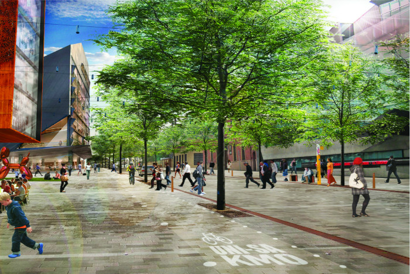
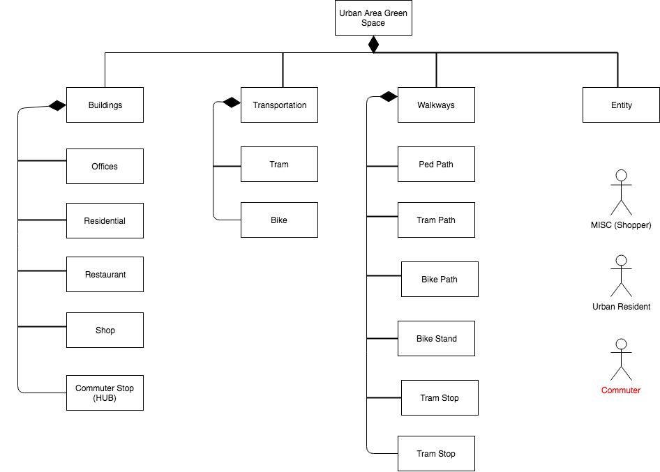

# IDS6145 - Research Plan  

> * Group Name: Divide & conquer 

> * Group participants names: Chiang, Hsian-Chin; Coad, Jonathan; Lord, John 

> * Project Title: How to Ace Green Space 

  

In our proposal, we wish to model a representation of an urban, city street that is turned to green space. We look to answer whether commuters can transition through said city street in an efficient and timely manner while utilizing shared resources. We believe that transitioning cities into car free “green zones” could enhance timeliness for commuters while reducing congestion and help to improve emission reduction.

  

 

## Introduction  

Project Goal: We wish to observe what the best, or average travel time may be for commuters to get through public, eco-city property while utilizing shared resources.  

A smart city, or “eco-city” promotes the health and prosperity of its’ citizenry. This idea of transforming areas into green space has several potential benefits.  

*  Reduced carbon emissions mean that the air will be less polluted and cleaner for pedestrians  

*  The removal of independent vehicles on the roadway increases the safety levels of the street 

*  An overall boost to public health both mentally and physically and increased social awareness        
   (Kuo & Sullivan, 2001; White, 2013) 

While we've been able to research a traditional "park and ride" method of transportation, we look to model more of a "park and walk" idea. We believe that given the opportunity, people might prefer to commute on foot given that commuting times are equivalent. It is an idea that some schools have implemented and could work well in urban environments as well. Very little, if any research exists on this topic meaning that we are investigating new and exciting areas of research. 

The United States Census Bureau reports that American workers have chosen to ride their bike when commuting to work at a significant rate. Over the course of a 10-year span, the number of cyclist commuters went up over 50%. Commuters who choose to walk are boasting high numbers as well, but automobiles still dominate as the primary mode of transportation. We look to change that.

++Our problem++ To show that transitioning to car-free superblocks can be just as, if not more efficient than the traditional method of commuting. This can become complicated due to the development of cities within America, and how the population is used to traditional routine when it comes to commuting. Additiionallhy, we must show that walking is a viable option, even when resources are shared.

++Our Motivation++ To promote eco-friendly transportation when traversing through an urban area and positive well-being with well designed green space for commuters.

++Our proposed solution++ is to implement the idea of eco-friendly, urban, green zones into more cities within the United States. First, we will create a model of an urban city street. First, we will model a single street and analyze the average time for commuters to walk from one end to the other. Additional resources will be added to future iterations of our model in the sense of bicycles and a tram, along with additional entities that utilize the sam resources. We will then discover the difference in time that it takes for commuters to travel down the street while utilizing resources that are now shared.

 

++Our contributions++ for this proposal include the following towards this and future projects: 

1. By promoting green zones within urban areas in the US, we are contributing to the mental health and eco-friendly environment. 

2. By conducting a discrete-event simulation with the said variables, we are promoting the idea that green spaces are viable for transportation within rural communities.

 

## The Model 

 

##Requirements:  

Overcrowding, pollution, and lack of recreation are all problems that a major city must face. To help alleviate these issues, green space(s) have been implemented, and somewhat successfully. This paper proposes the following experiment to see how well cities can transition from their current situation into eco-friendlier green zones. Requirements are as follows: 

1.  Given an urban area of size (n), wherein all the streets are closed to public traffic 

2.  Given public transportation is available (scalable) in the same area 

    a.  Public tram with single route
      i. Tram includes up to three cars (can vary) 
     ii. Tram carries a maximum of twenty-five passengers per car 
    iii. Tram travels a constant speed of fifteen mph 
   
    b.     Public bike rentals available at various locations through the area 
      i. Bikes can only carry ONE passenger 
     ii. Bikes travel at a constant of five mph 
    iii. Bikes can only travel on their pre-determined path. 

    c.     Pedestrian path delineated through the area 
      i. Pedestrians can only travel on pedestrian area 
     ii. Pedestrians travel at two and a half mph 
3.  Commuter debarkation points are set

4.  Public interaction random AND set – population (p) size feasible for area (n) of consideration
    a.  Random population living within urban area traversing from point A (home) to point B (work)
    b.  Random population commute to debarkation point (parking garage) and traversing from point A (parking garage) to point B (work)
    c.  All population randomly utilizing one of three modes of transportation 
      i. Walking paths 
     ii. Bike lanes (rental bikes)
    iii. Public tram
    
5. Population movement times set (if necessary)
    a.  Small percentage (10%) of population movement constantly between 6:00 a.m. and 11:00 p.m. – represents miscellaneous population
    b.  Random percentage (15-30%) of population movement between 9:00 a.m. and 11:00 p.m. – represents population utilizing businesses and green space
    c.  Working population (55%) movement between 6:00 a.m. and 9:00 a.m. (morning), 11:30 a.m. and 1:00 p.m. (lunch), and 3:30 p.m. and 6:30 p.m. (evening) 

6.  All buildings within area (n) identified
    a.  Office buildings
    b.  Residedntial buildings
    c.  Restaurant/entertainment building 

7.  Must compute and report average time for commuters to traverse from point A to point B 

 

## Fundamental Questions 

*  What is the average time for commuters to travel from point A to point B

*   Given an average commute time, how does it vary when additional entities are competing to use the same resources

*   How can we reduce the average commute time for pedestrians utilizing shared resources in an urban green space

 

## Expected Results 

We hypothesize the following: 

1. Overall the average time of commute given an individual recourse (ped, bike, tram) is positively affected by the number of resources available, until a point of diminishing returns, when the amount of resources available either does not affect commute time, or negatively affects commute times. 

2. Combining all three resource types will positively affect the overall average commute time and have a lower point of diminishing returns wherein the amount of resources negatively effects the average commute time. 

 

 

## Research Methods 

We believe that our goal can best be accomplished by using a discrete-event simulation. Specifically, we will use AnyLogic to model the city space and use human-like entities as our agents. Our city space will be representative of an urban city street that has been turned into green space. The discrete-event simulation was chosen because all agent choices are randomized (therefore not agent-based), and we will be examining events taking place in time (therefore not continuous based). The model will need to be simulate multiple times to produce the average wait time for commuters as they travel from point A to point B.  

 

## References 

Balch, O. (2015, April 20). Garden cities: can green space bring health and happiness? Retrieved from The Guardian: https://www.theguardian.com/sustainable-business/2015/apr/20/garden-cities-can-green-spaces-bring-health-and-happiness 

Garfield, L. (2017, February 2). Business Insider. Retrieved from 12 major cities that are starting to go car-free: http://www.businessinsider.com/cities-going-car-free-2017-2 

Kuo, F. E. (2001). Aggression and Violence in the Inner City: Effects of Environment via Mental Fatigue. Environment and Behavior, 543-571. 

Nieuwenhuijsen, M.J., & Khreis, H. (2016). Car Free Cities: Pathway to Healthy Urban Living. Environment International, 94, 251-262.  

Phillips, B. (2016, July 20). A 23-Foot-Tall Air Purifier Gets a Tryout in Smoggy Beijing. Retrieved from https://www.nytimes.com/2016/07/21/us/a-23-foot-tall-air-purifier-gets-a-tryout-in-smoggy-beijing.html?_r=0  

U.S. Census Bureau. (2014, May). Modes Less Traveled—Bicycling and Walking to Work in the United States: 2008–2012 (Report No. ACS-25). Retrieved from https://www.census.gov/content/dam/Census/library/publications/2014/acs/acs-25.pdf

Vox. (2016, September 27). Superblocks: How Barcelona is taking city streets back from cars. Retrieved from YouTube: https://www.youtube.com/watch?v=ZORzsubQA_M 

White, M. P. (2013). Would You Be Happier Living in a Greener Urban Area? A Fixed-Effects Analysis of Panel Data. Psychological Science, 920-928.
